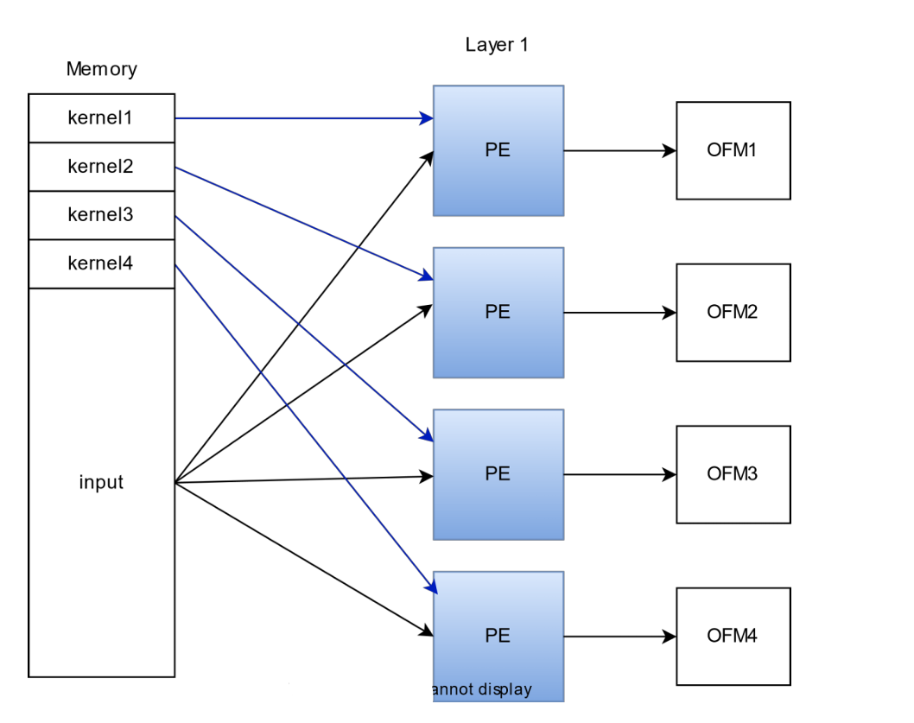
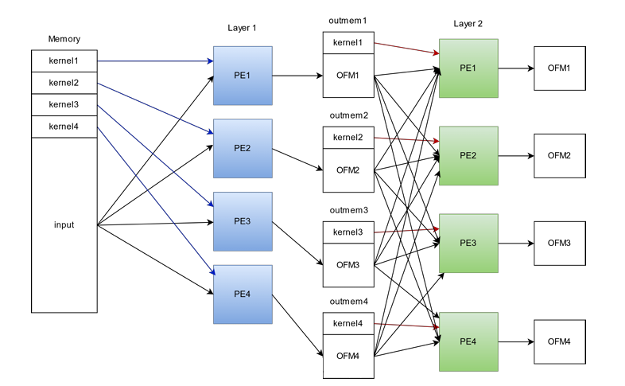

# Computer-Aided-Design-Course

This repository contains all projects related to the CAD course offered by University of Tehran.

# Table of Contents

- [Repository Structure](#repository-structure)
- [Requirements](#requirements)
- [Usage](#usage)
- [Credits](#credits)
- [Contact](#contact)

## Repository Structure

The repository is organized into the following structure:

### Projects

1. MaxNet: In this Project we developed a hardware based implementation of MaxNet Using verilog. This model finds the max value among for testcases provided.

2. Midterm: In this Project a simple unit of a CNN structure has been developed in hardware manner. Recieving a 16\*16 picture and a 4\*4 filter it performs the convolution calculations.

3. MaxNet with Actel modules : In this Project we developed a hardware based implementation of MaxNet based on the four type of Actel modules, `C1`, `C2`, `S1`, and `S2` making it easy to simulate it on a FPGA board.

4. CNN phase 1: In this Project we developed a CNN layer architecture as shown below.
<br><br>
<div align="center">
    
</div>
<br>

5. CNN phase 2: In this Project using the layer implemented in the previous phase we complete the CNN as we add a new layer to the design.

<br><br>

<div align="center">
    
</div>
<br>

## Requirements

Make sure you have Modelsim installed on your machine. ModelSim is a multi-language environment for simulation of hardware description languages such as VHDL, Verilog and SystemC.

## Usage

1. Clone the repo

   ```sh
     git clone https://github.com/MahdiNoori2003/Computer-Aided-Design-Course.git
   ```

2. Open `Modelsim` and create a project in code/trunc/sim folder

3. run the command below to start simulation :

   ```sh
     do sim_top.tcl
   ```

- Note :

  ```text
   Feel free to add your own testcase for each project in code/trunc/sim/file. 👩‍💻
  ```

4. Enjoy 🧨

## Credits

- [Mahdi Noori](https://github.com/MahdiNoori2003)

## Contact

- [hitking2007@gmail.com]()
